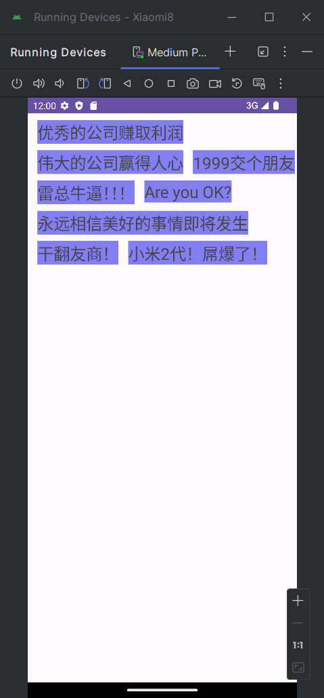

# Day8

#### 效果展示

[sdulearner-Day8.apk](Xiaomi8/app/release/sdulearner-Day8.apk)


##### 1、完成“标签云”控件，包括自定义属性

* **新建TagCloud类继承FrameLayout，编写setTags(List<String> tags)方法来加载TagCloud**

  ```java
      public void setTags(List<String> tags) {
          if (this.mTags != tags) {
              mTags = tags;
              int tagCount = mTags != null ? mTags.size() : 0;//获取总标签数
              int childCount = getChildCount();// 获取现有的子View数
              if (tagCount > childCount) {// 总标签数大于子View数，向后追加
                  for (int i = childCount; i < tagCount; i++) {
                      TextView child = new TextView(getContext());
                      child.setTextSize(25);//字体大小
                      child.setMaxLines(1);//最多一行
                      child.setEllipsize(TextUtils.TruncateAt.END);//截断方式
                      child.setBackgroundColor(R.color.sky_blue);//背景色
                      addView(child, i);//添加子View
  
                  }
              } else if (tagCount < childCount) {//标签数量小于子View数量，移出
                  for (int i = childCount; i > tagCount; i--) {
                      removeViewAt(childCount);
                  }
              }
              for (int i = 0; i < getChildCount(); i++) {
                  ((TextView) getChildAt(i)).setText(mTags.get(i));//设置text
  
              }
          }
      }
  ```

* **在activity_main.xml文件中添加TagCloud控件**

  ```xml
  <?xml version="1.0" encoding="utf-8"?>
  <androidx.constraintlayout.widget.ConstraintLayout xmlns:android="http://schemas.android.com/apk/res/android"
      xmlns:app="http://schemas.android.com/apk/res-auto"
      xmlns:tools="http://schemas.android.com/tools"
      android:layout_width="match_parent"
      android:layout_height="match_parent"
      tools:context=".MainActivity">
  
      <com.example.xiaomi8.TagCloud
          android:id="@+id/edit"
          android:layout_width="match_parent"
          android:layout_height="wrap_content"
          android:background="@null"
          android:gravity="top"
          app:hMargin="15dp"
          app:vMargin="10dp" />
  
  </androidx.constraintlayout.widget.ConstraintLayout>
  ```

* **MainActivity中添加Tag**

  ```java
  List<String> t = new ArrayList<>();
          t.add("优秀的公司赚取利润");
          t.add("伟大的公司赢得人心");
          t.add("1999交个朋友");
          t.add("雷总牛逼！！！");
          t.add("Are you OK?");
          t.add("永远相信美好的事情即将发生");
          t.add("干翻友商！");
          t.add("小米2代！屌爆了！");
          ((TagCloud) findViewById(R.id.edit)).setTags(t);
  ```

* **在TagCloud.java中编写onMeasure和onLayout方法**

  ```java
      // 测量每个子View的位置
      @Override
      protected void onMeasure(int widthMeasureSpec, int heightMeasureSpec) {
          //  传入宽度测量模式和尺寸
          int widthSpecMode = MeasureSpec.getMode(widthMeasureSpec);
          int widthSpecSize = MeasureSpec.getSize(widthMeasureSpec);
          //  传入高度的测量模式和尺寸
          int heightSpecMode = MeasureSpec.getMode(heightMeasureSpec);
          int heightSpecSize = MeasureSpec.getSize(heightMeasureSpec);
          Log.i(TAG, "widthSpecSize: " + widthSpecSize + " heightSpecSize:" + heightSpecSize);
          //  设置子View的宽度
          int childWidthSpec;
          switch (widthSpecMode) {
              case MeasureSpec.AT_MOST:
              case MeasureSpec.EXACTLY:
                  // 计算需要传给子View的 MeasureSpec
                  childWidthSpec = MeasureSpec.makeMeasureSpec(widthSpecSize - ((int) mHorizontalMargin * 2), MeasureSpec.AT_MOST);
                  break;
              case MeasureSpec.UNSPECIFIED:
              default:
                  childWidthSpec = widthMeasureSpec;
                  break;
          }
          //  设置子View的高度
          int childHeightSpec;
          switch (heightSpecMode) {
              case MeasureSpec.AT_MOST:
              case MeasureSpec.EXACTLY:
                  // 计算需要传给子View的 MeasureSpec
                  childHeightSpec = MeasureSpec.makeMeasureSpec(heightSpecSize - ((int) mVerticalMargin * 2), MeasureSpec.AT_MOST);
                  break;
              case MeasureSpec.UNSPECIFIED:
              default:
                  childHeightSpec = heightMeasureSpec;
                  break;
          }
  
          //  计算l,t,r,b
          int height = 0; // 当前高度坐标 Y轴
          int remainWidth = 0; // 保持宽度坐标 X轴
          int top = 0; // 顶部 Y轴
          //遍历全部子View
          for (int i = 0; i < getChildCount(); i++) {
              Log.i(TAG, "childWidthSpec: " + MeasureSpec.getSize(childWidthSpec) + " childHeightSpec: " + MeasureSpec.getSize(childHeightSpec));
              // 将测量要求传给子View
              View child = getChildAt(i);
              child.measure(childWidthSpec, childHeightSpec);
              // left, top, right, bottom
              int l, t, r, b;
              // 第一行:height=0
              // 新起一行
              if (height == 0 || remainWidth + mHorizontalMargin + child.getMeasuredWidth() > widthSpecSize) {
                  t = height + (int) mVerticalMargin;
                  top = t;
  
                  height += mVerticalMargin + child.getMeasuredHeight();
                  b = height;
  
                  remainWidth = (int) mHorizontalMargin;
                  l = remainWidth;
  
                  remainWidth += child.getMeasuredWidth();
                  r = remainWidth;
              } else {
                  //每行的后几个
                  t = top;//复用刚才记录下来的 top
                  b = top + child.getMeasuredHeight();//根据top计算底部坐标
                  l = remainWidth + (int) mHorizontalMargin;//剩余宽度+margin 等于左侧左边
                  remainWidth += mHorizontalMargin + child.getMeasuredWidth();//剩余宽度+margin+子view宽度=剩余宽度坐标
                  r = remainWidth;
              }
              // 记录下在当前子View里面，等下用
              Location location = new Location(l, t, r, b);
              child.setTag(location);
          }
          setMeasuredDimension(widthSpecSize, heightSpecSize);
  //        super.onMeasure(widthMeasureSpec, heightMeasureSpec);
      }
      // 遍历全部的子View，获取位置分发layout
      @Override
      protected void onLayout(boolean changed, int left, int top, int right, int bottom) {
          for (int i = 0; i < getChildCount(); i++) {
              Log.i(TAG, "onLayout: " + i);
              View child = getChildAt(i);
              Location location = (Location) child.getTag();
              child.layout(location.getL(), location.getT(), location.getR(), location.getB());
          }
      }
  ```

  

* **实现效果**

  
  
  
  


##### 2、实现View跟随手指滑动效果

* **在TagCloud.java的构造方法中为mDetector设置监听器**

  ```java
  public TagCloud(@NonNull Context context, @Nullable AttributeSet attrs) {
          super(context, attrs);
          TypedArray a = context.obtainStyledAttributes(attrs, R.styleable.TagCloud);
          mHorizontalMargin = a.getDimension(R.styleable.TagCloud_hMargin, 20);
          mVerticalMargin = a.getDimension(R.styleable.TagCloud_vMargin, 10);
  
          mDetector = new GestureDetector(this.getContext(), new GestureDetector.OnGestureListener() {
              @Override
              public boolean onDown(@NonNull MotionEvent e) {
  
                  RectF r = new RectF();
                  for (int i = 0; i < getChildCount(); i++) {
                      View view = getChildAt(i);
                      r.set(view.getLeft(), view.getTop(), view.getRight(), view.getBottom());
                      if (r.contains(e.getX(), e.getY())) {
                          select(view, i);
                          break;
                      }
                  }
                  return true;
              }
  
              @Override
              public void onShowPress(@NonNull MotionEvent e) {
  
              }
  
              @Override
              public boolean onSingleTapUp(@NonNull MotionEvent e) {
                  return false;
              }
  
              @Override
              public boolean onScroll(@Nullable MotionEvent e1, @NonNull MotionEvent e2, float distanceX, float distanceY) {
                  if (mSelectView != null) {
                      scrollSelectView(distanceX, distanceY);
                      return true;
                  } else {
                      return false;
                  }
              }
  
              @Override
              public void onLongPress(@NonNull MotionEvent e) {
                  if (mSelectView != null) {
                      Toast.makeText(getContext(), ((TextView) mSelectView).getText(), Toast.LENGTH_SHORT).show();
                  }
              }
  
              @Override
              public boolean onFling(@Nullable MotionEvent e1, @NonNull MotionEvent e2, float velocityX, float velocityY) {
                  release();
                  return true;
              }
          });
      }
  ```

* **实现手指按下(select)、滑动(scrollSelectView)、松开(release)时的效果**

  ```java
      // 手指按下时播放动画
      private void select(View view, int index) {
          mSelectView = view;
          ScaleAnimation scaleAnimation = new ScaleAnimation(1f, 1.2f,
                  1f, 1.2f,
                  Animation.RELATIVE_TO_SELF, 0.5f,
                  Animation.RELATIVE_TO_SELF, 0.5f);
          scaleAnimation.setDuration(200);
          scaleAnimation.setFillAfter(true);
          view.startAnimation(scaleAnimation);
      }
  
      // 手指滑动时，需要除以缩放比例
      private void scrollSelectView(float distanceX, float distanceY) {
          mSelectView.setTranslationX(mSelectView.getTranslationX() - distanceX * 5 / 6);
          mSelectView.setTranslationY(mSelectView.getTranslationY() - distanceY * 5 / 6);
      }
  
      // 手指松开时取消动画并复原位置
      private void release() {
          if (mSelectView != null) {
              mSelectView.clearAnimation();
              mSelectView.setTranslationX(0);
              mSelectView.setTranslationY(0);
          }
          mSelectView = null;//将选中的子View设为null，避免滑动空白处也能移动
      }
  ```

* **设置onTouchEvent**

  ```java
      // 如果松开手指则调用release()方法，其他的情况根据mDetector的监听器执行
      @Override
      public boolean onTouchEvent(MotionEvent event) {
  
          if (event.getAction() == MotionEvent.ACTION_UP) {
              if (mSelectView != null) {
                  release();
                  return true;
              }
          }
          return mDetector.onTouchEvent(event);
      }
  ```

  


##### 3、在原有拖拽的基础上，新按下的手指接管并继续进行拖拽

* **要实现这个效果，需要跟踪每个手指的按下和抬起事件，并维护一个状态来记录当前可以拖动的手指。维护了一个activePointerId变量来跟踪当前正在拖动的手指的ID。当有新手指按下时将其设为下一个激活的手指(nextPointerId)，当之前按下的手指抬起时将nextPointerId对应的手指设为激活状态。这样，只有第一个按下的手指能够拖动视图，直到它松开后，第二个按下的手指才能开始拖动。**

* **实现效果**

  

* **更改mDetector中的onDown方法**

  ```java
  mDetector = new GestureDetector(this.getContext(), new GestureDetector.OnGestureListener() {
              @Override
              public boolean onDown(@NonNull MotionEvent e) {
                  Log.i(TAG, "onTouchEvent: ACTION_DOWN");
                  int actionIndex = e.getActionIndex(); // 获取当前动作的索引
                  int pointerId = e.getPointerId(actionIndex); // 获取当前动作的指针ID
                  activePointerId = pointerId;
                  activePointerX = e.getX(actionIndex);
                  activePointerY = e.getY(actionIndex);
                  RectF r = new RectF();
                  for (int i = 0; i < getChildCount(); i++) {
                      View view = getChildAt(i);
                      r.set(view.getLeft(), view.getTop(), view.getRight(), view.getBottom());
                      if (r.contains(e.getX(), e.getY())) {
                          select(view, i);
                          break;
                      }
                  }
                  return true;
              }
  ```

* **更改onTouchEvent方法**

  ```java
   private float activePointerX;
      private float activePointerY;
      private int activePointerId = -1; // 初始化为-1，表示没有手指在拖动
      private int nextPointerId = -1; //两个手指同时按下时的第二个手指
  
      @Override
      public boolean onTouchEvent(MotionEvent event) {
          int actionIndex = event.getActionIndex(); // 获取当前动作的索引
          int action = event.getActionMasked(); // 获取动作类型
          int pointerId = event.getPointerId(actionIndex); // 获取当前动作的指针ID
  
          switch (action) {
              // 第二个手指按下
              case MotionEvent.ACTION_POINTER_DOWN:
                  Log.i(TAG, "onTouchEvent: ACTION_POINTER_DOWN");
                  nextPointerId = pointerId;
                  return true;
  
              case MotionEvent.ACTION_MOVE:
                  if (activePointerId != -1 && activePointerId == pointerId) {
                      // 只有当当前手指是激活的手指时，才允许移动
                      float deltaX = activePointerX - event.getX(actionIndex);
                      float deltaY = activePointerY - event.getY(actionIndex);
                      // 移动视图
                      if (mSelectView != null) {
                          scrollSelectView(deltaX, deltaY);
                          // 更新激活手指的位置
                          activePointerX = event.getX(actionIndex);
                          activePointerY = event.getY(actionIndex);
                          return true;
                      } else {
                          return false;
                      }
                  }
                  return true;
  
              case MotionEvent.ACTION_UP:
                  if (mSelectView != null) {
                      release();
                      return true;
                  }
                  return true;
              // 其中的一个手指抬起，将nextPointerId对应的手指设为激活状态
              case MotionEvent.ACTION_POINTER_UP:
                  if (activePointerId == pointerId) {
                      // 如果激活的手指抬起了，激活另一个手指
                      Log.i(TAG, "onTouchEvent: ACTION_POINTER_UP");
                      activePointerId = nextPointerId;
                  }
                  return true;
          }
          return mDetector.onTouchEvent(event);
      }
  ```

* **更改release方法**

  ```java
      private void release() {
          if (mSelectView != null) {
              mSelectView.clearAnimation();
              mSelectView.setTranslationX(0);
              mSelectView.setTranslationY(0);
              //
              activePointerId = -1;
              nextPointerId = -1;
          }
          mSelectView = null;//将选中的子View设为null，避免滑动空白处也能移动
      }
  ```

* **试了一下如果手指个数超过两个（三个及以上）就无法实现相应的效果，改进的话可以考虑用栈来实现。**

  

##### 4、实现拖拽后可调整标签的位置

* **老师我还在写这部分的代码，马上就好**

* **实现效果**


