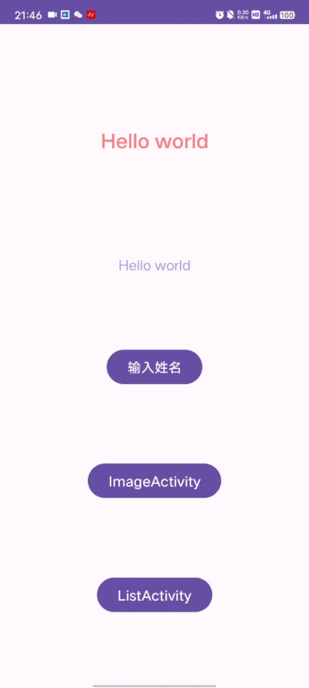
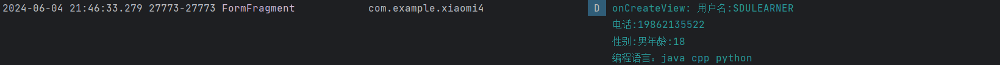

# Day4

##### 1、在一个Fragment里面实现一个拥有textview，edittext，radiobutton， checkbox，buton，seekbar，imagveiw的，能实现表单提交功能的页面，其中edittext只能大写字母，同时输入的数字要以*显示。

* **新建FormFragment，布局为fragment_form，在InputName中动态添加FormFragment，实现表单的提交功能。**

```java
//FormFragment
package com.example.xiaomi4;

import android.os.Bundle;

import androidx.fragment.app.Fragment;

import android.text.Editable;
import android.text.TextUtils;
import android.text.TextWatcher;
import android.util.Log;
import android.view.LayoutInflater;
import android.view.View;
import android.view.ViewGroup;
import android.widget.Button;
import android.widget.CheckBox;
import android.widget.CompoundButton;
import android.widget.EditText;
import android.widget.RadioButton;
import android.widget.RadioGroup;
import android.widget.SeekBar;
import android.widget.TextView;
import android.widget.Toast;

public class FormFragment extends Fragment {
    private static final String TAG = "FormFragment";
    private final boolean[] chooseLanguage = {false, false, false};

    @Override
    public View onCreateView(LayoutInflater inflater, ViewGroup container, Bundle savedInstanceState) {
		//Inflate the layout for this fragment
        View view = inflater.inflate(R.layout.fragment_form, container, false);

        StringBuilder stringBuilder = new StringBuilder();
        Button showName = view.findViewById(R.id.show_name);
        EditText inputNameEdit = view.findViewById(R.id.input_name_edit);
        //获取并显示EditText中的内容
        showName.setOnClickListener(new View.OnClickListener() {
            @Override
            public void onClick(View v) {
                Log.d(TAG, "onClick: ");
            }
        });
        //设置input_name_edit中只能输入大写字母
        EditText edit_name = view.findViewById(R.id.input_name_edit);
        EditText edit_phone = view.findViewById(R.id.input_phone_edit);

        Button button = view.findViewById(R.id.show_phone);
        edit_name.addTextChangedListener(new TextWatcher() {
            @Override
            public void beforeTextChanged(CharSequence s, int start, int count, int after) {
            }

            @Override
            public void onTextChanged(CharSequence s, int start, int before, int count) {
                if (TextUtils.isEmpty(s)) {
                    button.setEnabled(false);
                } else {
                    // 判断未尾输入
                    if (s.charAt(s.length() - 1) < 'A' | s.charAt(s.length() - 1) > 'Z') {
                        Toast.makeText(view.getContext(), "删除非数字字符:" + s.charAt(s.length() - 1), Toast.LENGTH_SHORT).show();
                        s = s.subSequence(0, s.length() - 1);
                        edit_name.setText(s);//设置新内容
                        edit_name.setSelection(s.length());//设置光标

                    }
                    // 设置按钮样式
                    button.setEnabled(s.length() > 0);
                }

            }

            @Override
            public void afterTextChanged(Editable s) {
            }
        });

        //choose gender
        RadioGroup radioGroup = view.findViewById(R.id.radioGroup);
        final boolean[] flag = {true}; //默认为男
        radioGroup.setOnCheckedChangeListener(new RadioGroup.OnCheckedChangeListener() {
            @Override
            public void onCheckedChanged(RadioGroup group, int checkedId) {
                RadioButton radioButton = view.findViewById(checkedId);
                flag[0] = checkedId == R.id.btnMan;
                Toast.makeText(view.getContext(), "单选框，值为" + radioButton.getText(), Toast.LENGTH_SHORT).show();
            }
        });
        //choose age
        SeekBar age = view.findViewById(R.id.age);
        TextView ageText = view.findViewById(R.id.age_text);
        final int[] ageNumber = {0};
        age.setOnSeekBarChangeListener(new SeekBar.OnSeekBarChangeListener() {
            @Override
            public void onProgressChanged(SeekBar seekBar, int progress, boolean fromUser) {
                ageNumber[0] = progress;
                ageText.setText("请选择您的年龄:" + +progress);
            }

            @Override
            public void onStartTrackingTouch(SeekBar seekBar) {
            }

            @Override
            public void onStopTrackingTouch(SeekBar seekBar) {
            }
        });


        //Checkbox选择语言
        CheckBox java = view.findViewById(R.id.java);
        java.setOnCheckedChangeListener(new CompoundButton.OnCheckedChangeListener() {
            @Override
            public void onCheckedChanged(CompoundButton buttonView, boolean isChecked) {
                if (isChecked) {
                    // 选中状态的操作
                    chooseLanguage[0] = true;
                }
            }
        });
        CheckBox cpp = view.findViewById(R.id.cpp);
        cpp.setOnCheckedChangeListener(new CompoundButton.OnCheckedChangeListener() {
            @Override
            public void onCheckedChanged(CompoundButton buttonView, boolean isChecked) {
                if (isChecked) {
                    chooseLanguage[1] = true;
                }
            }
        });
        CheckBox python = view.findViewById(R.id.python);
        python.setOnCheckedChangeListener(new CompoundButton.OnCheckedChangeListener() {
            @Override
            public void onCheckedChanged(CompoundButton buttonView, boolean isChecked) {
                if (isChecked) {
                    chooseLanguage[2] = true;
                }
            }
        });

        button.setOnClickListener(v -> {
            stringBuilder.append("用户名:").append(edit_name.getText()).append("\n");
            stringBuilder.append("电话:").append(edit_phone.getText()).append("\n");
            stringBuilder.append("性别:").append(flag[0] ? "男" : "女");
            stringBuilder.append("年龄:").append(ageNumber[0]).append("\n");
            stringBuilder.append("编程语言：").append(chooseLanguage[0] ? "java " : " ").append(chooseLanguage[1] ? "cpp " : " ").append(chooseLanguage[2] ? "python " : " ");
            String info = new String(stringBuilder);
            Log.d(TAG, "onCreateView: " + info);
        });
        return view;
    }
    public FormFragment() {
    }

    public static FormFragment newInstance(String param1, String param2) {
        FormFragment fragment = new FormFragment();
        Bundle args = new Bundle();
        fragment.setArguments(args);
        return fragment;
    }
    @Override
    public void onCreate(Bundle savedInstanceState) {
        super.onCreate(savedInstanceState);
    }
}
```

```xml
<?xml version="1.0" encoding="utf-8"?>
<androidx.constraintlayout.widget.ConstraintLayout xmlns:android="http://schemas.android.com/apk/res/android"
    xmlns:app="http://schemas.android.com/apk/res-auto"
    xmlns:tools="http://schemas.android.com/tools"
    android:layout_width="match_parent"
    android:layout_height="match_parent"
    tools:context=".FormFragment">

    <TextView
        android:id="@+id/input_name_text"
        android:layout_width="wrap_content"
        android:layout_height="wrap_content"
        android:text="请输入信息:"
        android:textSize="22sp"
        app:layout_constraintBottom_toTopOf="@+id/input_name_edit"
        app:layout_constraintEnd_toEndOf="parent"
        app:layout_constraintStart_toStartOf="parent"
        app:layout_constraintTop_toTopOf="parent" />

    <EditText
        android:id="@+id/input_name_edit"
        android:layout_width="wrap_content"
        android:layout_height="wrap_content"
        android:layout_marginTop="50dp"
        android:ems="10"
        android:hint="用户名(仅限大写字母)"
        android:inputType="text"
        app:layout_constraintBottom_toTopOf="@id/input_phone_edit"
        app:layout_constraintEnd_toEndOf="parent"
        app:layout_constraintStart_toStartOf="parent"
        app:layout_constraintTop_toBottomOf="@id/input_name_text" />

    <EditText
        android:id="@+id/input_phone_edit"
        android:layout_width="wrap_content"
        android:layout_height="wrap_content"
        android:ems="10"
        android:hint="电话(仅限数字)"
        android:inputType="numberPassword"
        app:layout_constraintBottom_toTopOf="@id/choose_gender"
        app:layout_constraintEnd_toEndOf="parent"
        app:layout_constraintStart_toStartOf="parent"
        app:layout_constraintTop_toBottomOf="@id/input_name_edit"
        app:layout_constraintVertical_bias="0" />

    <TextView
        android:id="@+id/choose_gender"
        android:layout_width="wrap_content"
        android:layout_height="wrap_content"
        android:text="请选择性别"
        android:textSize="23dp"
        app:layout_constraintBottom_toTopOf="@+id/radioGroup"
        app:layout_constraintEnd_toEndOf="parent"
        app:layout_constraintStart_toStartOf="parent"
        app:layout_constraintTop_toBottomOf="@id/input_phone_edit" />

    <RadioGroup
        android:id="@+id/radioGroup"
        android:layout_width="wrap_content"
        android:layout_height="wrap_content"
        android:orientation="horizontal"
        app:layout_constraintBottom_toTopOf="@+id/age_text"
        app:layout_constraintEnd_toEndOf="parent"
        app:layout_constraintStart_toStartOf="parent"
        app:layout_constraintTop_toBottomOf="@id/choose_gender"
        app:layout_constraintVertical_bias="0">

        <RadioButton
            android:id="@+id/btnMan"
            android:layout_width="wrap_content"
            android:layout_height="wrap_content"
            android:checked="true"
            android:text="男" />

        <RadioButton
            android:id="@+id/btnWoman"
            android:layout_width="wrap_content"
            android:layout_height="wrap_content"
            android:text="女" />

    </RadioGroup>

    <TextView
        android:id="@+id/age_text"
        android:layout_width="wrap_content"
        android:layout_height="wrap_content"
        android:text="请选择您的年龄:"
        android:textSize="22sp"
        app:layout_constraintBottom_toTopOf="@+id/age"
        app:layout_constraintEnd_toEndOf="parent"
        app:layout_constraintStart_toStartOf="parent"
        app:layout_constraintTop_toBottomOf="@+id/radioGroup"
        app:layout_constraintVertical_bias="0" />

    <SeekBar
        android:id="@+id/age"
        android:layout_width="match_parent"
        android:layout_height="wrap_content"
        app:layout_constraintBottom_toTopOf="@+id/language_text"
        app:layout_constraintEnd_toEndOf="parent"
        app:layout_constraintStart_toStartOf="parent"
        app:layout_constraintTop_toBottomOf="@id/age_text" />

    <TextView
        android:id="@+id/language_text"
        android:layout_width="wrap_content"
        android:layout_height="wrap_content"
        android:text="请选择您的编程语言:"
        android:textSize="22sp"
        app:layout_constraintBottom_toTopOf="@+id/checkbox"
        app:layout_constraintEnd_toEndOf="parent"
        app:layout_constraintStart_toStartOf="parent"
        app:layout_constraintTop_toBottomOf="@+id/age"
        app:layout_constraintVertical_bias="0" />

    <LinearLayout
        android:id="@+id/checkbox"
        android:layout_width="match_parent"
        android:layout_height="wrap_content"
        android:gravity="center"
        android:orientation="horizontal"
        app:layout_constraintBottom_toTopOf="@+id/show_name"
        app:layout_constraintEnd_toEndOf="parent"
        app:layout_constraintStart_toStartOf="parent"
        app:layout_constraintTop_toBottomOf="@id/language_text">

        <CheckBox
            android:id="@+id/java"
            android:layout_width="wrap_content"
            android:layout_height="wrap_content"
            android:text="java" />

        <CheckBox
            android:id="@+id/cpp"
            android:layout_width="wrap_content"
            android:layout_height="wrap_content"
            android:text="c++" />

        <CheckBox
            android:id="@+id/python"
            android:layout_width="wrap_content"
            android:layout_height="wrap_content"
            android:text="python" />
    </LinearLayout>

    <Button
        android:id="@+id/show_name"
        android:layout_width="wrap_content"
        android:layout_height="wrap_content"
        android:text="姓名"
        android:visibility="gone"
        app:layout_constraintBottom_toTopOf="@+id/show_phone"
        app:layout_constraintEnd_toEndOf="parent"
        app:layout_constraintStart_toStartOf="parent"
        app:layout_constraintTop_toBottomOf="@id/age" />

    <Button
        android:id="@+id/show_phone"
        android:layout_width="wrap_content"
        android:layout_height="wrap_content"
        android:enabled="false"
        android:text="确定"
        app:layout_constraintBottom_toTopOf="@+id/ad"
        app:layout_constraintEnd_toEndOf="parent"
        app:layout_constraintStart_toStartOf="parent"
        app:layout_constraintTop_toBottomOf="@id/show_name" />

    <ImageView
        android:id="@+id/ad"
        android:layout_width="wrap_content"
        android:layout_height="225dp"
        app:layout_constraintBottom_toBottomOf="parent"
        app:layout_constraintEnd_toEndOf="parent"
        app:layout_constraintStart_toStartOf="parent"
        app:srcCompat="@drawable/ad" />

</androidx.constraintlayout.widget.ConstraintLayout>
```

* **实现效果**

  







##### 2、实现一个列表，要求具有点击事件，item样式需包含文字图片，实现增加删除列表项功能。


##### 3、在2的基础上，增加或者删除后，所有项显示的position值需要同步更新，支持用户界面指定放置位置(如果用户指定的值超过，最后一个项的位置值+1,告诉用户位置过大，小于第一个放置在第一个位置)。


* **老师我马上就写完了，请稍等片刻我会上传作业三**


##### 4、富文本与SeekBar


~~老师其实我手机上没有原神，我是云玩家~~


