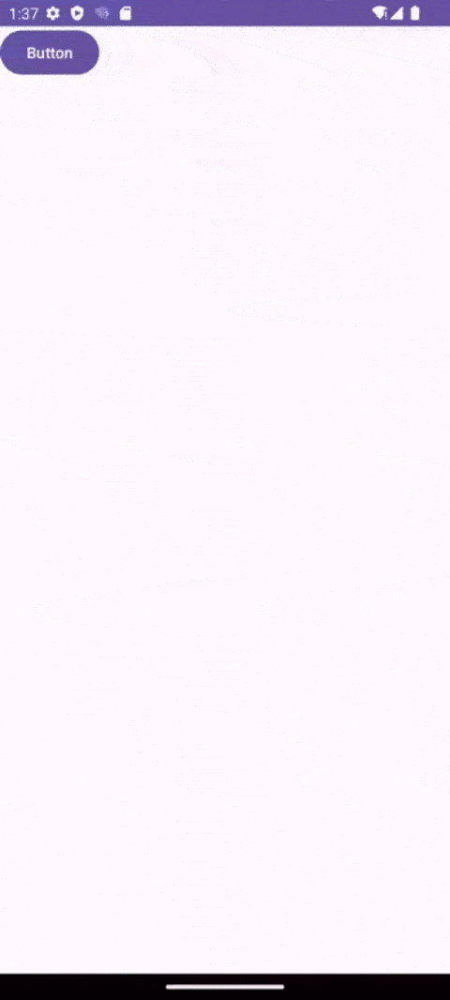
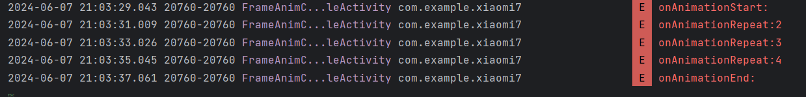
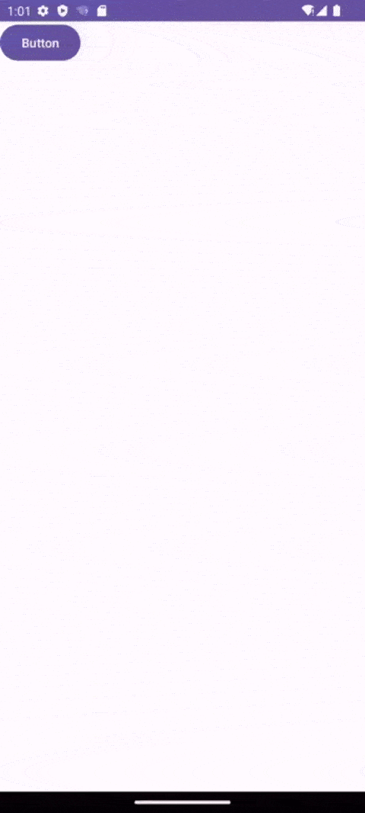

# Day7

#### 效果展示

[sdulearner-Day7.apk](Xiaomi7/app/release/sdulearner-Day7.apk)



##### 1、使用补间动画，基于当前 vew 中心点放大1.5倍，同时逆时针旋转720度，由不透明变为透明度0.8，持续2000ms，并且重复动画3次。(要求:任选XML或Java方式实现，动画开始时打印日志“animation start”，动画重复时打印“animation repeat”以及重复了2次，动画结束时打印日志“animation end”)

* **anim_set.xml**

  ```xml
  <?xml version="1.0" encoding="utf-8"?>
  <set xmlns:android="http://schemas.android.com/apk/res/android">
      <scale
          android:fromXScale="1.0"
          android:fromYScale="1.0"
          android:pivotX="50%"
  
          android:pivotY="50%"
          android:toXScale="1.5"
          android:toYScale="1.5" />
      <rotate
          android:fromDegrees="0"
          android:pivotX="50%"
          android:pivotY="50%"
          android:toDegrees="-720" />
      <alpha
          android:fromAlpha="1.0"
          android:toAlpha="0.8" />
  </set>
  ```

* **FrameAnimCodeSampleActivity.java**

  ```java
  //1、基于当前 vew 中心点放大1.5倍，同时逆时针旋转720度，由不透明变为透明度0.8，持续2000ms，并且重复动画3次
  AnimationSet animationSet = (AnimationSet) AnimationUtils.loadAnimation(this, R.anim.anim_set);
  repeatCount = 1;
  animationSet.setDuration(2000);
  //重复播放动画3次，由于AnimationSet本身并不直接支持setRepeatCount()方法，所以为每个子动画设置重复次数
  for (Animation anim : animationSet.getAnimations()) {
      anim.setRepeatCount(3);
      anim.setRepeatMode(Animation.RESTART); // 每次重复重新播放动画
  }
  imageView.startAnimation(animationSet);
  //打印日志
  animationSet.getAnimations().get(0).setAnimationListener(new Animation.AnimationListener() {
      @Override
      public void onAnimationStart(Animation animation) {
          Log.e(TAG, "onAnimationStart: ");
      }
      @Override
      public void onAnimationEnd(Animation animation) {
          Log.e(TAG, "onAnimationEnd: ");
      }
      @Override
      public void onAnimationRepeat(Animation animation) {
          Log.e(TAG, "onAnimationRepeat:" + (repeatCount+=1));
      }
  });
  ```

* **实现效果**

  

  


##### 2、实现属性动画，使用 AnimatorSet，先是当前 View围绕X轴旋转 360 度，持续1000ms；然后向右移动 120px，持续1000ms;最后从不透明变成透明度0.5，持续500ms。(要求:使用Java方式实现，需要有2个基础动画同时执行，有1个顺序执行，且实现至少2种不同效果的自定义插值器与估值器)

* **FrameAnimCodeSampleActivity.java**

  ```java
  //实现属性动画，使用 AnimatorSet，先是当前 View围绕X轴旋转 360 度，持续1000ms；然后向右移动120px，持续1000ms;
  // 最后从不透明变成透明度0.5，持续500ms。(要求:使用Java方式实现，需要有2个基础动画同时执行，有1个顺序执行，
  // 且实现至少2种不同效果的自定义插值器与估值器)
  
  AnimatorSet animatorSet = new AnimatorSet();
  ObjectAnimator rotationXAnimator = ObjectAnimator.ofFloat(textView, View.ROTATION_X, 0f, 360f);
  //设置自定义的Evaluator
  rotationXAnimator.setDuration(1000).setEvaluator(new MyCustomEvaluator());
  
  ObjectAnimator translateXAnimator = ObjectAnimator.ofFloat(textView, View.TRANSLATION_X, 0f, 120f);
  translateXAnimator.setDuration(1000);
  
  ObjectAnimator alphaAnimator = ObjectAnimator.ofFloat(textView, View.ALPHA, 1.0f, 0.5f);
  alphaAnimator.setDuration(500);
  //设置旋转和平移同时执行
  animatorSet.playTogether(rotationXAnimator, translateXAnimator);
  //设置透明度变化在平移后执行
  animatorSet.play(alphaAnimator).after(translateXAnimator);
  //设置自定义的Interpolator
  animatorSet.setInterpolator(new MyCustomInterpolator());
  animatorSet.start();
  ```

* **MyCustomEvaluator.java**

  ```java
  package com.example.xiaomi7;
  
  import android.animation.TypeEvaluator;
  
  public class MyCustomEvaluator implements TypeEvaluator<Object> {
      @Override
      public Object evaluate(float fraction, Object startValue, Object endValue) {
          //简单的线性插值
          float startFloat = (Float) startValue;
          float endFloat = (Float) endValue;
          return (startFloat + (endFloat - startFloat) * fraction);
      }
  }
  ```

* **MyCustomInterpolator **

  ```java
  package com.example.xiaomi7;
  
  import android.animation.TimeInterpolator;
  
  public class MyCustomInterpolator implements TimeInterpolator {
      @Override
      public float getInterpolation(float input) {
          return input * input; // 使动画开始时慢，结束时快
      }
  }
  ```

  

# Day6 Bug Fix

##### 3、**显示瀑布流**

##### 今天发现了问题出在没有在HomeAdapter中添加界面资源的设置，导致Adatper只能更新一个布尔值，而不能更新界面显示。

~~感觉昨晚像脑子抽了一样，明明是一个简单的小Bug却苦苦思索接近两个小时😓~~

* HomeAdapter.java

  ```java
  package com.example.xiaomi6;
  
  import ...
  
  public class HomeAdapter extends BaseQuickAdapter<HomeItem, BaseViewHolder> implements LoadMoreModule {
      public HomeAdapter(int layoutResId, @Nullable List<HomeItem> data) {
          super(layoutResId, data);
      }
  
      public HomeAdapter(int layoutResId) {
          super(layoutResId);
      }
  
      @Override
      public void onBindViewHolder(@NonNull BaseViewHolder holder, int position) {
  
          super.onBindViewHolder(holder, position);
      }
  
      @Override
      protected void convert(@NonNull BaseViewHolder baseViewHolder, HomeItem homeItem) {
          //加载更多1:实现LoadMoreModule
          ImageView imageView = baseViewHolder.getView(R.id.big_icon);
          TextView textView = baseViewHolder.getView(R.id.big_text);
          Glide.with(imageView.getContext())
                  .load(homeItem.getImageResource())
                  .into(imageView);
          textView.setText(homeItem.getTitle());
          TextView big_like = baseViewHolder.getView(R.id.big_like);
  		// todo:bug修复完毕
  		if (homeItem.isLike())
     			 big_like.setBackgroundResource(R.drawable.like_fill);
  		else big_like.setBackgroundResource(R.drawable.like);
      }
  }
  ```
  
* HomeFragment.java

  ```java
      //响应EventBus
      @Subscribe(threadMode = ThreadMode.MAIN)
      public void onMsgEvent(MessageEvent message) {
          Log.e(TAG, "onMsgEvent: " + message.getPosition() + message.isLike());
          HomeItem click_data = data.get(message.getPosition());
          data.set(message.getPosition(), new HomeItem(click_data.getTitle(), click_data.getImageResource(), message.isLike()));
          getActivity().runOnUiThread(new Runnable() {
              @Override
              public void run() {
                  mAdapter.notifyDataSetChanged();
              }
          });
      }
  ```
  
* **最终实现效果**

  
  
  
  
* **打包apk**

  [sdulearner-Day6.apk](./Xiaomi6/app/release/sdulearner-Day6.apk "sdulearner-Day6.apk")
  
  
  
  
