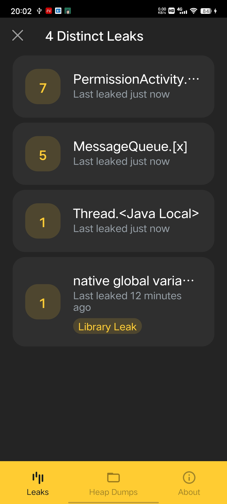
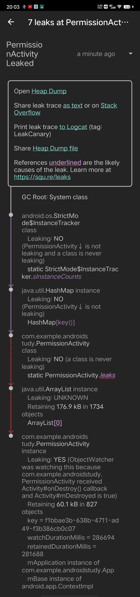
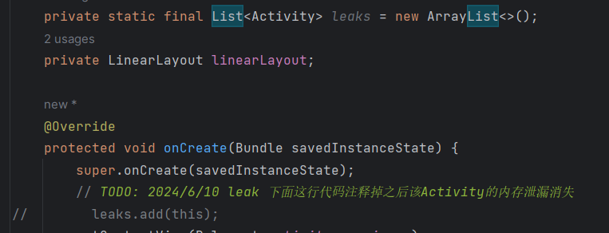
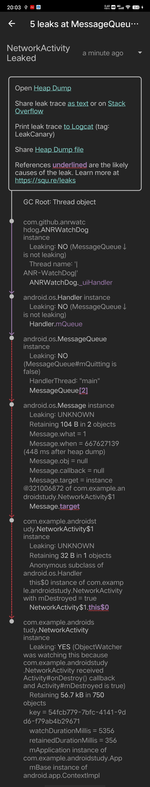
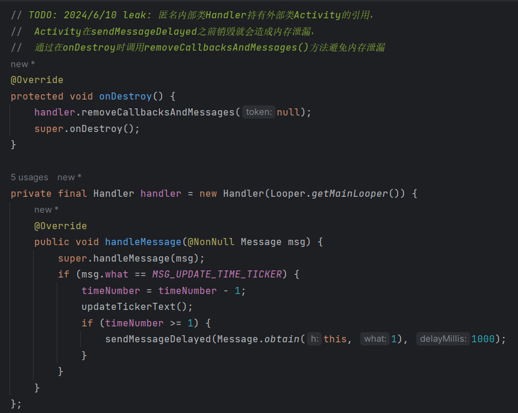
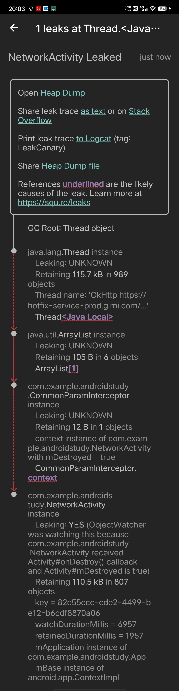

# Day10

##### 1、寻找并修改MemoryLeakAndAnr项目中的内存泄漏



1. **第一个内存泄漏位于PermissionActivity**

   

2. **第二个leak位于NetworkActivity**

   

3. **第三个leak位于CommonParamInterceptor**

   

   ```java
   // TODO: 2024/6/10 leak:改为弱引用 
   public class CommonParamInterceptor implements Interceptor {
       private final WeakReference<Context> contextWeakReference;
   
       public CommonParamInterceptor(Context contextWeakReference) {
           this.contextWeakReference = new WeakReference<>(contextWeakReference);
       }
   
       private int getAppVersionCode() {
           try {
               Context context = contextWeakReference.get();
               if (context == null) {
                   throw new IllegalStateException("Context is null");
               }
               return context.getPackageManager().getPackageInfo(context.getPackageName(), 0).versionCode;
           } catch (PackageManager.NameNotFoundException e) {
               throw new RuntimeException(e);
           }
       }
   
       @NonNull
       @Override
       public Response intercept(@NonNull Chain chain) throws IOException {
           HttpUrl.Builder builder = chain.request().url().newBuilder();
           builder.addQueryParameter("appVersionCode", Integer.toString(getAppVersionCode()));
           return chain.proceed(chain.request());
       }
   }
   ```

##### 2、优化ANR-WatchDog检测ANR机制。思路:可以考虑针对发送到主线程的消息做个策略，将原来的5s发送一次改为1s发送一次，假如累计有5次发出且5次都回不了包，则表示有ANR的现象，再采集线程信息。

见`ANRWatchDog.java`的注释

