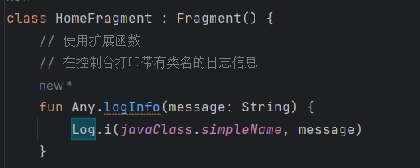
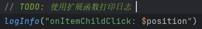
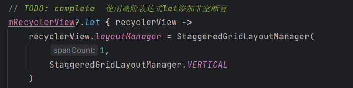
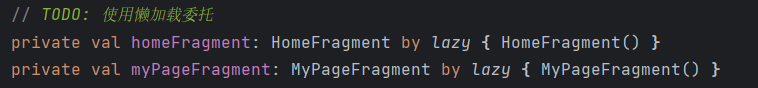

# Day11

#### 使用Kotlin实现滑动列表，支持点击查看详情大图和文案，包含下拉刷新功能要求:

#### 1.创建两个页面，一个首页，一个我的页面；可以通过底部按钮点击进行切换，点击首页展示首页，点击我的展示我的页面。

#### 2.首页使用RecyclerView和BaseRecyclerViewAdapterHelper实现一个列表，列表有两种类型，分别是文本类型和图片类型；两种类型均有点赞状态；已点赞；显示已点赞；未点赞；显示等在点赞中；点击可改变点赞状态。

#### 3.首页使用SwipeRefreshLayout实现下拉刷新和上拉加载，数据自己模拟。

#### 4.详情页展示对应的类型，如果点击文字类型则显示文字，如果点击图片类型则展示图片；同时详情页可以点赞和取消点赞；操作后状态同步到首页，刷新列表。

* **效果展示**

[sdulearner-Day11.apk](Xiaomi11/app/release/sdulearner-Day11.apk)

##### 1、使用扩展函数

##### 2、使用高阶函数

##### 3、使用委托

