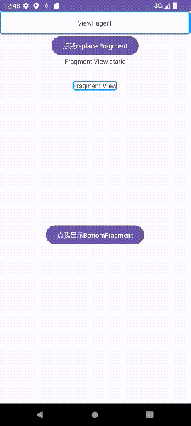
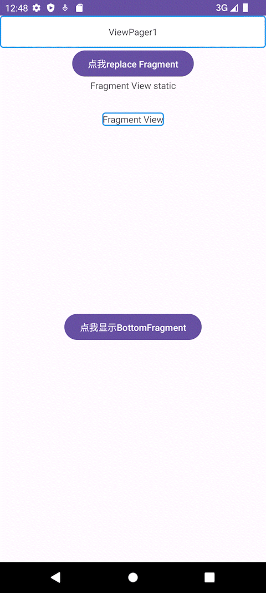

# Day3

##### 1、搭建App首页，一个Activity有多个Fragment，点击底部Tab切换Fragment，Fragment只显示一个文本即可，点击按钮跳转到另一个Fragment。


```java
//replace Fragment1
Button button = findViewById(R.id.my_button);    
button.setOnClickListener(v -> {
        fragmentManager.beginTransaction()
                .setCustomAnimations(R.anim.go_in, R.anim.go_out, R.anim.go_in, R.anim.go_out)//添加动画
                .setReorderingAllowed(true)
                .replace(R.id.fragment_container_view_static, DemoFragment2.class, null)
                .addToBackStack(null)//将ExampleFragment(被replace的Fragment)压栈
                .commit();
    });
```




##### 2、使用ViewPager实现Fragment左右滑动。

* **activity_main中添加ViewPager**

```xml
<androidx.viewpager.widget.ViewPager xmlns:android="http://schemas.android.com/apk/res/android"
        android:id="@+id/pager"
        android:layout_width="wrap_content"
        android:layout_height="50dp"
        app:layout_constraintBottom_toTopOf="@id/my_button"
        app:layout_constraintEnd_toEndOf="parent"
        app:layout_constraintStart_toStartOf="parent"
        app:layout_constraintTop_toTopOf="parent" />
```

* **DemoCollectionPagerAdapter继承FragmentStatePagerAdapter**

```java
package com.example.xiaomi3;

import android.os.Bundle;
import android.widget.TextView;

import androidx.annotation.NonNull;
import androidx.annotation.Nullable;
import androidx.fragment.app.Fragment;
import androidx.fragment.app.FragmentManager;
import androidx.fragment.app.FragmentStatePagerAdapter;

public class DemoCollectionPagerAdapter extends FragmentStatePagerAdapter {
    public DemoCollectionPagerAdapter(@NonNull FragmentManager fm) {
        super(fm);
    }

    @NonNull
    @Override
    public Fragment getItem(int position) {
        Fragment fragment = new DemoFragment();
        Bundle args = new Bundle();
        args.putInt(DemoFragment.POSITION, position + 1);
        fragment.setArguments(args);
        return fragment;
    }

    @Override
    public int getCount() {
        return 3;
    }

    @Nullable
    @Override
    public CharSequence getPageTitle(int position) {
        return "DemoFragment: " + (position + 1);
    }
}

```

* **DemoFragment中根据传入的**ViewPager**的**position**修改**TextView**的显示**

```java
 @Nullable
    @Override
    public View onCreateView(@NonNull LayoutInflater inflater, @Nullable ViewGroup container, @Nullable Bundle savedInstanceState) {
        View view = inflater.inflate(example_fragment2, container, false);
        TextView textView = view.findViewById(R.id.textView2);
        int position = requireArguments().getInt(POSITION);
        if (position != 0) textView.setText("ViewPager" + position);
        return view;
    }
```

* **MainActivity中构建滑动视图**

```java
        //构建滑动视图
        DemoCollectionPagerAdapter demoCollectionPagerAdapter = new DemoCollectionPagerAdapter(fragmentManager);
        ViewPager viewpager = (ViewPager) findViewById(R.id.pager);
        viewpager.setAdapter(demoCollectionPagerAdapter);
```

* **为Fragment添加边框**

```xml
<?xml version="1.0" encoding="utf-8"?>
<shape xmlns:android="http://schemas.android.com/apk/res/android">
    <solid android:color="#FFFFFF"/> <!-- 背景颜色 -->
    <stroke
        android:width="2dp"
        android:color="#2196F3"/> <!-- 边框宽度和颜色 -->
    <padding android:left="1dp"
        android:top="1dp"
        android:right="1dp"
        android:bottom="1dp"/>
    <corners android:radius="4dp"/> <!-- 边框圆角 -->
</shape>
......
<!--layout文件中:-->
<TextView
        android:id="@+id/textView2"
        android:layout_width="match_parent"
        android:layout_height="match_parent"
        android:background="@drawable/border"
        android:gravity="center"
        android:text="Fragment View"
        app:layout_constraintBottom_toBottomOf="parent"
        app:layout_constraintEnd_toEndOf="parent"
        app:layout_constraintStart_toStartOf="parent"
        app:layout_constraintTop_toTopOf="parent" />
......
```

**效果展示：**


##### 3、设置fragment的动画效果。

* **动画文件go_in.xml**

  ```xml
  <?xml version="1.0" encoding="utf-8"?>
  <translate xmlns:android="http://schemas.android.com/apk/res/android"
      android:duration="@android:integer/config_longAnimTime"
      android:fromXDelta="100%"
      android:interpolator="@android:anim/decelerate_interpolator"
      android:toXDelta="0%" />
  ```

* **动画文件go_out.xml**

  ```xml
  <?xml version="1.0" encoding="utf-8"?>
  <translate xmlns:android="http://schemas.android.com/apk/res/android"
      android:duration="@android:integer/config_longAnimTime"
      android:fromXDelta="0%"
      android:interpolator="@android:anim/decelerate_interpolator"
      android:toXDelta="100%" />
  
  ```

* **添加动画效果**

  ```java
  Button button = findViewById(R.id.my_button);    
  button.setOnClickListener(v -> {
          fragmentManager.beginTransaction()
                  .setCustomAnimations(R.anim.go_in, R.anim.go_out, R.anim.go_in, R.anim.go_out)//添加动画
                  .setReorderingAllowed(true)
                  .replace(R.id.fragment_container_view_static, DemoFragment2.class, null)
                  .addToBackStack(null)
                  .commit();
      });
  ```

  **效果展示：**


##### 4、点击TopFragment的按钮启动BottomFragment

**通过点击TopFragment的按钮实现与BottomFragment通信**

* **TopFragment**

  ```java
  package com.example.xiaomi3;
  
  import android.content.Context;
  import android.os.Bundle;
  import android.view.LayoutInflater;
  import android.view.View;
  import android.view.ViewGroup;
  
  import androidx.annotation.NonNull;
  import androidx.annotation.Nullable;
  import androidx.fragment.app.Fragment;
  
  public class TopFragment extends Fragment {
      public interface TopPageActionListener {
          void onTopPageAction();
      }
  
      private TopPageActionListener topPageActionListener;
  
      public TopFragment() {
          super(R.layout.top_fragment);
      }
  
      /**
      为TopFragment的按钮添加点击事件，其具体实现在MainActivity
       */
      @Nullable
      @Override
      public View onCreateView(@NonNull LayoutInflater inflater, @Nullable ViewGroup container, @Nullable Bundle savedInstanceState) {
          View view = inflater.inflate(R.layout.top_fragment, container, false);
          view.findViewById(R.id.top_button).setOnClickListener(v -> {
              if (topPageActionListener != null) topPageActionListener.onTopPageAction();
          });
          return view;
      }
  
      /**
      onAttach时指定topPageActionListener
       */
      @Override
      public void onAttach(@NonNull Context context) {
          super.onAttach(context);
          if (context instanceof TopPageActionListener) {
              topPageActionListener = (TopPageActionListener) context;
          }
      }
  
      @Override
      public void onDetach() {
          super.onDetach();
          topPageActionListener = null;
      }
  }
  ```

* **MainActivity中实现接口**

  ```java
  public class MainActivity extends AppCompatActivity implements TopFragment.TopPageActionListener {
  ......
  @Override
      public void onTopPageAction() {
          getSupportFragmentManager().beginTransaction()
                  .replace(R.id.top_fragment, BottomFragment.class, null)
                  .commitNow();
      }
  }
  ```

**实现效果：**




