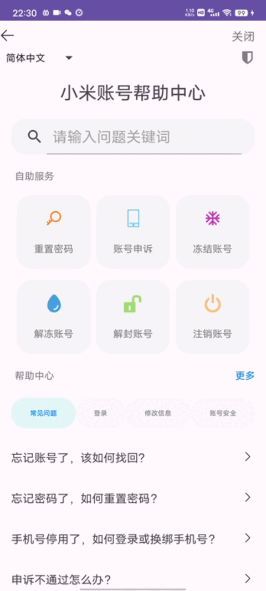
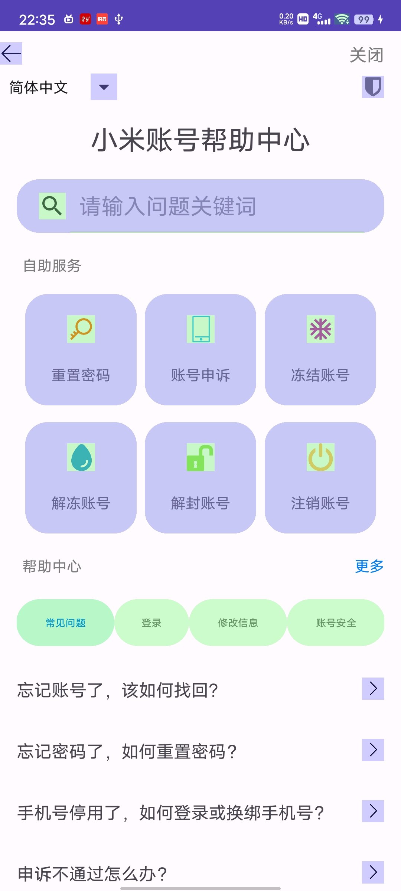
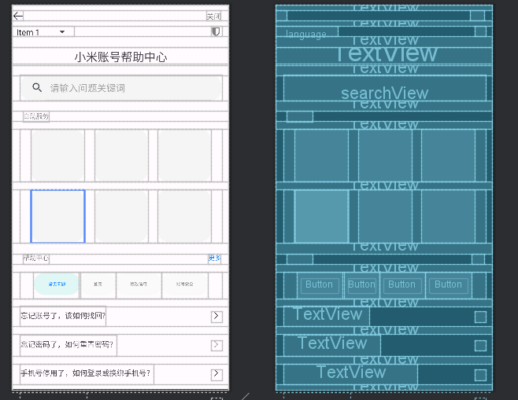

# Day5

##### 1、正常写出UI图



##### 2、使用最少布局层级实现，查看页面过度绘制，尽量优化代码层级结构，提供过度绘制截图



##### 3.使用include优化布局代码，减少xml代码量



* **activity_main.xml**

  ```xml
  <?xml version="1.0" encoding="utf-8"?>
  <androidx.constraintlayout.widget.ConstraintLayout xmlns:android="http://schemas.android.com/apk/res/android"
      xmlns:app="http://schemas.android.com/apk/res-auto"
      xmlns:tools="http://schemas.android.com/tools"
      android:layout_width="match_parent"
      android:layout_height="match_parent"
      tools:context=".MainActivity">
      <!--    最上方留白10dp-->
      <TextView
          android:id="@+id/up_blank"
          android:layout_width="0dp"
          android:layout_height="10dp"
          android:alpha="0"
          app:layout_constraintEnd_toEndOf="parent"
          app:layout_constraintStart_toStartOf="parent"
          app:layout_constraintTop_toTopOf="parent" />
      <!--    返回和关闭-->
      <TextView
          android:id="@+id/back_btn"
          android:layout_width="20dp"
          android:layout_height="20dp"
          android:background="@drawable/back"
          app:layout_constraintStart_toStartOf="parent"
          app:layout_constraintTop_toBottomOf="@+id/up_blank" />
  
      <TextView
          android:id="@+id/back_text"
          android:layout_width="wrap_content"
          android:layout_height="20dp"
          android:layout_marginEnd="15dp"
          android:text="关闭"
          android:gravity="center"
          android:textColor="@color/gray1"
          app:layout_constraintEnd_toEndOf="parent"
          app:layout_constraintTop_toBottomOf="@+id/up_blank" />
      <!--    顶部添加留白布局10dp-->
      <TextView
          android:id="@+id/blank_1"
          android:layout_width="0dp"
          android:layout_height="10dp"
          android:alpha="0"
          app:layout_constraintEnd_toEndOf="parent"
          app:layout_constraintStart_toStartOf="parent"
          app:layout_constraintTop_toBottomOf="@+id/back_btn" />
      <!--    语言选择和安全中心图标-->
      <!-- 在布局文件中定义Spinner -->
      <Spinner
          android:id="@+id/language"
          android:layout_width="0dp"
          android:layout_height="20dp"
          app:layout_constraintStart_toStartOf="parent"
          app:layout_constraintTop_toBottomOf="@+id/blank_1" />
  
      <TextView
          android:id="@+id/safety"
          android:layout_width="20dp"
          android:layout_height="20dp"
          android:layout_marginEnd="15dp"
          android:alpha="0.5"
          android:background="@drawable/shield"
          android:textColor="@color/gray1"
          app:layout_constraintEnd_toEndOf="parent"
          app:layout_constraintTop_toBottomOf="@+id/blank_1" />
      <!--    添加留白布局20dp-->
      <TextView
          android:id="@+id/blank_2"
          android:layout_width="0dp"
          android:layout_height="20dp"
          android:alpha="0"
          app:layout_constraintEnd_toEndOf="parent"
          app:layout_constraintStart_toStartOf="parent"
          app:layout_constraintTop_toBottomOf="@+id/language" />
      <!--    小米账号帮助中心-->
      <TextView
          android:id="@+id/xiaomi_assist"
          android:layout_width="0dp"
          android:layout_height="wrap_content"
          android:gravity="center"
          android:text="小米账号帮助中心"
          android:textSize="22sp"
          app:layout_constraintEnd_toEndOf="parent"
          app:layout_constraintStart_toStartOf="parent"
          app:layout_constraintTop_toBottomOf="@+id/blank_2" />
      <!--    添加留白布局20dp-->
      <TextView
          android:id="@+id/blank_3"
          android:layout_width="0dp"
          android:layout_height="20dp"
          android:alpha="0"
          app:layout_constraintEnd_toEndOf="parent"
          app:layout_constraintStart_toStartOf="parent"
          app:layout_constraintTop_toBottomOf="@+id/xiaomi_assist" />
      <!--    请输入问题关键词:左右设置15dp背景设置为浅灰色的圆角矩形(rounded_background)
      iconifiedByDefault="false"默认为展开状态
      android:paddingEnd="10dp"为了不让下划线出圆角矩形-->
      <SearchView
          android:id="@+id/searchView"
          android:layout_width="0dp"
          android:layout_height="wrap_content"
          android:layout_marginStart="15dp"
          android:layout_marginEnd="15dp"
          android:background="@drawable/rounded_background"
          android:iconifiedByDefault="false"
          android:paddingEnd="10dp"
          android:queryHint="请输入问题关键词"
          app:layout_constraintEnd_toEndOf="parent"
          app:layout_constraintStart_toStartOf="parent"
          app:layout_constraintTop_toBottomOf="@+id/blank_3" />
      <!--    添加留白布局20dp-->
      <TextView
          android:id="@+id/blank_4"
          android:layout_width="0dp"
          android:layout_height="20dp"
          android:alpha="0"
          app:layout_constraintEnd_toEndOf="parent"
          app:layout_constraintStart_toStartOf="parent"
          app:layout_constraintTop_toBottomOf="@+id/searchView" />
      <!--    自助服务-->
      <TextView
          android:id="@+id/self_service"
          android:layout_width="wrap_content"
          android:layout_height="20dp"
          android:layout_marginStart="20dp"
          android:text="自助服务"
          android:textColor="@color/gray1"
          android:textSize="12sp"
          app:layout_constraintStart_toStartOf="parent"
          app:layout_constraintTop_toBottomOf="@+id/blank_4" />
      <!--    添加留白布局15dp-->
      <TextView
          android:id="@+id/blank_5"
          android:layout_width="0dp"
          android:layout_height="15dp"
          android:alpha="0"
          app:layout_constraintEnd_toEndOf="parent"
          app:layout_constraintStart_toStartOf="parent"
          app:layout_constraintTop_toBottomOf="@+id/self_service" />
      <!--    六个带图片的大按钮，使用两组约束布局配合include完成，间距为15dp-->
      <androidx.constraintlayout.widget.ConstraintLayout
          android:id="@+id/constraint1"
          android:layout_width="0dp"
          android:layout_height="wrap_content"
          android:layout_marginHorizontal="15dp"
          app:layout_constraintEnd_toEndOf="parent"
          app:layout_constraintStart_toStartOf="parent"
          app:layout_constraintTop_toBottomOf="@+id/blank_5">
  
          <include
              android:id="@+id/button1"
              layout="@layout/big_button"
              android:layout_width="0dp"
              android:layout_height="100dp"
              app:layout_constraintDimensionRatio="1:1"
              app:layout_constraintEnd_toStartOf="@+id/button2"
              app:layout_constraintHorizontal_chainStyle="spread"
              app:layout_constraintStart_toStartOf="parent" />
  
          <include
              android:id="@+id/button2"
              layout="@layout/big_button"
              android:layout_width="0dp"
              android:layout_height="100dp"
              app:layout_constraintDimensionRatio="1:1"
              app:layout_constraintEnd_toStartOf="@+id/button3"
              app:layout_constraintStart_toEndOf="@+id/button1" />
  
          <include
              android:id="@+id/button3"
              layout="@layout/big_button"
              android:layout_width="0dp"
              android:layout_height="100dp"
              app:layout_constraintDimensionRatio="1:1"
              app:layout_constraintEnd_toEndOf="parent"
              app:layout_constraintStart_toEndOf="@+id/button2" />
      </androidx.constraintlayout.widget.ConstraintLayout>
      <!--    添加留白布局15dp-->
      <TextView
          android:id="@+id/blank_6"
          android:layout_width="0dp"
          android:layout_height="15dp"
          android:alpha="0"
          app:layout_constraintEnd_toEndOf="parent"
          app:layout_constraintStart_toStartOf="parent"
          app:layout_constraintTop_toBottomOf="@+id/constraint1" />
  
      <androidx.constraintlayout.widget.ConstraintLayout
          android:id="@+id/constraint2"
          android:layout_width="0dp"
          android:layout_height="wrap_content"
          android:layout_marginHorizontal="15dp"
          app:layout_constraintEnd_toEndOf="parent"
          app:layout_constraintStart_toStartOf="parent"
          app:layout_constraintTop_toBottomOf="@+id/blank_6">
  
          <include
              android:id="@+id/button4"
              layout="@layout/big_button"
              android:layout_width="0dp"
              android:layout_height="100dp"
              app:layout_constraintDimensionRatio="1:1"
              app:layout_constraintEnd_toStartOf="@+id/button5"
              app:layout_constraintHorizontal_chainStyle="spread"
              app:layout_constraintStart_toStartOf="parent" />
  
          <include
              android:id="@+id/button5"
              layout="@layout/big_button"
              android:layout_width="0dp"
              android:layout_height="100dp"
              app:layout_constraintDimensionRatio="1:1"
              app:layout_constraintEnd_toStartOf="@+id/button6"
              app:layout_constraintStart_toEndOf="@+id/button4" />
  
          <include
              android:id="@+id/button6"
              layout="@layout/big_button"
              android:layout_width="0dp"
              android:layout_height="100dp"
              app:layout_constraintDimensionRatio="1:1"
              app:layout_constraintEnd_toEndOf="parent"
              app:layout_constraintStart_toEndOf="@+id/button5" />
      </androidx.constraintlayout.widget.ConstraintLayout>
      <!--    添加留白布局20dp-->
      <TextView
          android:id="@+id/blank_7"
          android:layout_width="0dp"
          android:layout_height="20dp"
          android:alpha="0"
          app:layout_constraintEnd_toEndOf="parent"
          app:layout_constraintStart_toStartOf="parent"
          app:layout_constraintTop_toBottomOf="@+id/constraint2" />
      <!--帮助中心&更多-->
      <TextView
          android:id="@+id/help_center"
          android:layout_width="wrap_content"
          android:layout_height="20dp"
          android:layout_marginStart="20dp"
          android:text="帮助中心"
          android:textColor="@color/gray1"
          android:textSize="12sp"
          app:layout_constraintStart_toStartOf="parent"
          app:layout_constraintTop_toBottomOf="@+id/blank_7" />
  
      <TextView
          android:id="@+id/more"
          android:layout_width="wrap_content"
          android:layout_height="20dp"
          android:layout_marginEnd="15dp"
          android:text="更多"
          android:textColor="@color/link"
          android:textSize="12sp"
          app:layout_constraintEnd_toEndOf="parent"
          app:layout_constraintTop_toBottomOf="@+id/blank_7" />
      <!--    添加留白布局15dp-->
      <TextView
          android:id="@+id/blank_8"
          android:layout_width="0dp"
          android:layout_height="15dp"
          android:alpha="0"
          app:layout_constraintEnd_toEndOf="parent"
          app:layout_constraintStart_toStartOf="parent"
          app:layout_constraintTop_toBottomOf="@+id/help_center" />
      <!--    四个按钮横向排列，在自己的手机上会有button超出屏幕的问题，
      目前是用调小字体和按钮宽度解决，应该会有更好的解决方法-->
      <androidx.constraintlayout.widget.ConstraintLayout
          android:id="@+id/constraint3"
          android:layout_width="0dp"
          android:layout_height="wrap_content"
          android:layout_marginHorizontal="15dp"
          app:layout_constraintEnd_toEndOf="parent"
          app:layout_constraintStart_toStartOf="parent"
          app:layout_constraintTop_toBottomOf="@+id/blank_8">
  
  
          <Button
              android:id="@+id/button7"
              android:layout_width="wrap_content"
              android:layout_height="50dp"
              android:backgroundTint="@color/light_blue"
              android:text="常见问题"
              android:textColor="@color/link"
              android:textSize="8sp"
              app:layout_constraintEnd_toStartOf="@+id/button8"
              app:layout_constraintHorizontal_chainStyle="packed"
              app:layout_constraintStart_toStartOf="parent" />
  
          <Button
              android:id="@+id/button8"
              android:layout_width="67dp"
              android:layout_height="50dp"
              android:backgroundTint="@color/very_light_gray"
              android:text="登录"
              android:textColor="@color/gray1"
              android:textSize="8sp"
              app:layout_constraintEnd_toStartOf="@+id/button9"
              app:layout_constraintStart_toEndOf="@+id/button7" />
  
          <Button
              android:id="@+id/button9"
              android:layout_width="wrap_content"
              android:layout_height="50dp"
              android:backgroundTint="@color/very_light_gray"
              android:text="修改信息"
              android:textColor="@color/gray1"
              android:textSize="8sp"
              app:layout_constraintEnd_toStartOf="@+id/button10"
              app:layout_constraintStart_toEndOf="@+id/button8" />
  
          <Button
              android:id="@+id/button10"
              android:layout_width="wrap_content"
              android:layout_height="50dp"
              android:backgroundTint="@color/very_light_gray"
              android:text="账号安全"
              android:textColor="@color/gray1"
              android:textSize="8sp"
              app:layout_constraintEnd_toEndOf="parent"
              app:layout_constraintStart_toEndOf="@+id/button9" />
  
      </androidx.constraintlayout.widget.ConstraintLayout>
      <!--    添加留白布局15dp-->
      <TextView
          android:id="@+id/blank_9"
          android:layout_width="0dp"
          android:layout_height="15dp"
          android:alpha="0"
          app:layout_constraintEnd_toEndOf="parent"
          app:layout_constraintStart_toStartOf="parent"
          app:layout_constraintTop_toBottomOf="@+id/constraint3" />
      <!--    常见问题
      忘记账号了，该如何找回?
      忘记密码了，如何重置密码?
      手机号停用了，如何登录或换绑手机号?
      申诉不通过怎么办?-->
      <TextView
          android:id="@+id/question_text1"
          android:layout_width="wrap_content"
          android:layout_height="40dp"
          android:layout_marginEnd="15dp"
          android:text="忘记账号了，该如何找回?"
          android:layout_marginStart="15dp"
          android:gravity="center"
          app:layout_constraintStart_toStartOf="parent"
          app:layout_constraintTop_toBottomOf="@+id/blank_9" />
  <!--通过layout_constraintBaseline_toBaselineOf与前面的文本对齐-->
      <TextView
          android:id="@+id/go_btn1"
          android:layout_width="20dp"
          android:layout_height="20dp"
          app:layout_constraintBaseline_toBaselineOf="@+id/question_text1"
          android:background="@drawable/right"
          app:layout_constraintEnd_toEndOf="parent"
          android:layout_marginEnd="15dp"
          app:layout_constraintTop_toBottomOf="@+id/blank_9" />
      <!--    添加留白布局15dp-->
      <TextView
          android:id="@+id/blank_10"
          android:layout_width="0dp"
          android:layout_height="15dp"
          android:alpha="0"
          app:layout_constraintEnd_toEndOf="parent"
          app:layout_constraintStart_toStartOf="parent"
          app:layout_constraintTop_toBottomOf="@+id/question_text1" />
      <!--忘记密码了，如何重置密码?-->
      <TextView
          android:id="@+id/question_text2"
          android:layout_width="wrap_content"
          android:layout_height="40dp"
          android:layout_marginEnd="15dp"
          android:text="忘记密码了，如何重置密码？"
          android:layout_marginStart="15dp"
          android:gravity="center"
          app:layout_constraintStart_toStartOf="parent"
          app:layout_constraintTop_toBottomOf="@+id/blank_10" />
      <!--通过layout_constraintBaseline_toBaselineOf与前面的文本对齐-->
      <TextView
          android:id="@+id/go_btn2"
          android:layout_width="20dp"
          android:layout_height="20dp"
          app:layout_constraintBaseline_toBaselineOf="@+id/question_text2"
          android:background="@drawable/right"
          app:layout_constraintEnd_toEndOf="parent"
          android:layout_marginEnd="15dp"
          app:layout_constraintTop_toBottomOf="@+id/blank_10" />
  
      <!--    添加留白布局15dp-->
      <TextView
          android:id="@+id/blank_11"
          android:layout_width="0dp"
          android:layout_height="15dp"
          android:alpha="0"
          app:layout_constraintEnd_toEndOf="parent"
          app:layout_constraintStart_toStartOf="parent"
          app:layout_constraintTop_toBottomOf="@+id/question_text2" />
      <!--手机号停用了，如何登录或换绑手机号?-->
      <TextView
          android:id="@+id/question_text3"
          android:layout_width="wrap_content"
          android:layout_height="40dp"
          android:layout_marginEnd="15dp"
          android:text="手机号停用了，如何登录或换绑手机号？"
          android:layout_marginStart="15dp"
          android:gravity="center"
          app:layout_constraintStart_toStartOf="parent"
          app:layout_constraintTop_toBottomOf="@+id/blank_11" />
      <TextView
          android:id="@+id/go_btn3"
          android:layout_width="20dp"
          android:layout_height="20dp"
          app:layout_constraintBaseline_toBaselineOf="@+id/question_text3"
          android:background="@drawable/right"
          app:layout_constraintEnd_toEndOf="parent"
          android:layout_marginEnd="15dp"
          app:layout_constraintTop_toBottomOf="@+id/blank_11" />
  
      <!--    添加留白布局15dp-->
      <TextView
          android:id="@+id/blank_12"
          android:layout_width="0dp"
          android:layout_height="15dp"
          android:alpha="0"
          app:layout_constraintEnd_toEndOf="parent"
          app:layout_constraintStart_toStartOf="parent"
          app:layout_constraintTop_toBottomOf="@+id/question_text3" />
      <!--申诉不通过怎么办?-->
      <TextView
          android:id="@+id/question_text4"
          android:layout_width="wrap_content"
          android:layout_height="40dp"
          android:layout_marginEnd="15dp"
          android:text="申诉不通过怎么办？"
          android:layout_marginStart="15dp"
          android:gravity="center"
          app:layout_constraintStart_toStartOf="parent"
          app:layout_constraintTop_toBottomOf="@+id/blank_12" />
      <!--通过layout_constraintBaseline_toBaselineOf与前面的文本对齐-->
      <TextView
          android:id="@+id/go_btn"
          android:layout_width="20dp"
          android:layout_height="20dp"
          app:layout_constraintBaseline_toBaselineOf="@+id/question_text4"
          android:background="@drawable/right"
          app:layout_constraintEnd_toEndOf="parent"
          android:layout_marginEnd="15dp"
          app:layout_constraintTop_toBottomOf="@+id/blank_12" />
  
  </androidx.constraintlayout.widget.ConstraintLayout>
  ```

* **作为include布局中的big_button.xml**

  ```xml
  <?xml version="1.0" encoding="utf-8"?>
  <androidx.constraintlayout.widget.ConstraintLayout xmlns:android="http://schemas.android.com/apk/res/android"
      xmlns:app="http://schemas.android.com/apk/res-auto"
      android:layout_width="match_parent"
      android:layout_height="match_parent"
      android:background="@drawable/rounded_background">
  
      <ImageView
          android:id="@+id/big_icon"
          android:layout_width="25dp"
          android:layout_height="25dp"
          app:layout_constraintBottom_toTopOf="@+id/big_text"
          app:layout_constraintEnd_toEndOf="parent"
          app:layout_constraintStart_toStartOf="parent"
          app:layout_constraintTop_toTopOf="parent" />
  
      <TextView
          android:id="@+id/big_text"
          android:layout_width="wrap_content"
          android:layout_height="wrap_content"
          android:textColor="@color/gray1"
          android:textSize="12sp"
          app:layout_constraintBottom_toBottomOf="parent"
          app:layout_constraintEnd_toEndOf="parent"
          app:layout_constraintStart_toStartOf="parent"
          app:layout_constraintTop_toBottomOf="@+id/big_icon" />
  
  </androidx.constraintlayout.widget.ConstraintLayout>
  ```

* **MainActivity.java**

  ```java
  package com.example.xiaomi5;
  
  import androidx.annotation.NonNull;
  import androidx.appcompat.app.AppCompatActivity;
  
  import android.media.Image;
  import android.os.Bundle;
  import android.text.SpannableString;
  import android.text.Spanned;
  import android.text.method.LinkMovementMethod;
  import android.text.style.ClickableSpan;
  import android.util.Log;
  import android.view.View;
  import android.view.ViewStub;
  import android.widget.ArrayAdapter;
  import android.widget.ImageView;
  import android.widget.Spinner;
  import android.widget.TextView;
  import android.widget.Toast;
  
  import org.w3c.dom.Text;
  
  public class MainActivity extends AppCompatActivity {
      private static final String TAG = "MainActivity";
  
      @Override
      protected void onCreate(Bundle savedInstanceState) {
          super.onCreate(savedInstanceState);
          setContentView(R.layout.activity_main);
          //装载语言选择Spinner
          ArrayAdapter<CharSequence> adapter = ArrayAdapter.createFromResource(
                  this,
                  R.array.language_array,
                  R.layout.my_spinner_item);
          adapter.setDropDownViewResource(android.R.layout.simple_spinner_dropdown_item);
          Spinner spinner = findViewById(R.id.language);
          spinner.setAdapter(adapter);
  
          //设置大按钮的icon和text
          String[] texts = new String[]{"重置密码", "账号申诉", "冻结账号", "解冻账号", "解封账号", "注销账号"};
          for (int i = 1; i <= 6; i++) {
              String name = "button" + i;
              String icon_name = "icon" + i;
              int id = getResources().getIdentifier(name, "id", getPackageName());  //获取大按钮的标识符
              int icon_id = getResources().getIdentifier(icon_name, "drawable", getPackageName());  //获取icon标识符
              Log.d(TAG, "icon_id:" + icon_id);
              View button = findViewById(id);
              ImageView icon = button.findViewById(R.id.big_icon);
              icon.setImageResource(icon_id);
              TextView text = button.findViewById(R.id.big_text);
              text.setText(texts[i - 1]);
          }
  
          //设置"更多"的点击事件
          TextView more = findViewById(R.id.more);
          more.setOnClickListener(v -> {
              Toast.makeText(MainActivity.this, "请访问小米官方客服中心获取更多信息", Toast.LENGTH_SHORT).show();
          });
      }
  }
  ```

  
