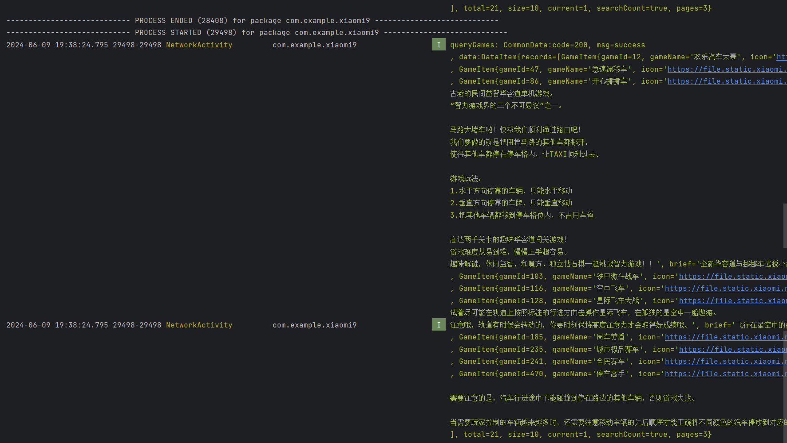

# Day9

#### 完成搜索功能，将搜索结果使用列表展示，支持页面下拉刷新和上拉加载更多；使用OkHttp或Retrofit方式进行网络请求


#### 效果展示


[sdulearner-Day9.apk](./app/release/sdulearner-Day9.apk)


##### 1、通过向服务器发送请求得知返回的参数主要有：游戏Id、游戏名称gameName、游戏图标icon、游戏介绍introduction、游戏简介brief、游戏版本versionName、安装包路径apkUrl、游戏标签tags、游戏评分score、玩家数playNumFormat、创建时间createTime

* **新建CommonData类**

  ```java
  public class CommonData<T> {
      public int code;
      public String msg;
      public T data;
  
      public String toString() {
          return "CommonData:" +
                  "code=" + code +
                  ", msg=" + msg + "\n" +
                  ", data:" + data;
      }
  }
  ```

* **新建GameItem类，包含上述主要参数**

  ```java
  public class GameItem {
      @Override
      public String toString() {
          return "GameItem{" +
                  "gameId=" + id +
                  ", gameName='" + gameName + '\'' +
                  ", icon='" + icon + '\'' +
                  ", introduction='" + introduction + '\'' +
                  ", brief='" + brief + '\'' +
                  ", versionName='" + versionName + '\'' +
                  ", apkUrl='" + apkUrl + '\'' +
                  ", tags='" + tags + '\'' +
                  ", score=" + score +
                  ", playNumFormat='" + playNumFormat + '\'' +
                  ", createTime='" + createTime + '\'' +
                  "}\n";
      }
  
      private int id;
      private String gameName;
      private String icon;
      private String introduction;
      private String brief;
      private String versionName;
      private String apkUrl;
      private String tags;
      private float score;
      private String playNumFormat;
      private String createTime;
  
      // Getters and Setters
  	······
  }
  ```

* 

* **新建DataItem类，包含上述data字段的信息**

  ```java
  public class DataItem {
      private List<GameItem> records;
      private int total;
      private int size;
      private int current;
      private boolean searchCount;
      private int pages;
  
      @Override
      public String toString() {
          return "DataItem{" +
                  "records=" + records +
                  ", total=" + total +
                  ", size=" + size +
                  ", current=" + current +
                  ", searchCount=" + searchCount +
                  ", pages=" + pages +
                  '}';
      }
          // Getters and Setters
  	······
  }
  ```

  

##### 2、使用Retrofit方式进行网络请求并打印日志

* **在NetworkActivity中实现ApiService接口**

  ```java
      public interface ApiService {
          // 根据Id查找游戏
          @GET("/quick-game/game/{id}")
          retrofit2.Call<CommonData<GameItem>> queryGame(@Path("id") String id);
  
          // 搜索游戏
          @GET("/quick-game/game/search")
          @Headers("Content-Type: application/json")
          retrofit2.Call<CommonData<DataItem>> queryGames(
                  @Query("search") String search, // 搜索内容
                  @Query("current") int current, // 当前页，默认1
                  @Query("size") int size // 当前页大小，默认10
          );
      }
  ```

* **NetworkActivity中相关变量**

  ```java
  	private final OkHttpClient okHttpClient = new OkHttpClient.Builder().build();
      private static final MediaType jsonType = MediaType.parse("application/json;charset=utf-8");
      private final Gson gson = new Gson();
      private final Handler handler = new Handler(Looper.getMainLooper()) {
          @Override
          public void handleMessage(@NonNull Message msg) {
              super.handleMessage(msg);
              if (msg.what == 1) textBody.setText((CharSequence) msg.obj);
          }
      };
      private final Retrofit retrofit = new Retrofit.Builder()
              .baseUrl("https://hotfix-service-prod.g.mi.com")
              .client(okHttpClient)
              .addConverterFactory(GsonConverterFactory.create(gson))
              .build();
      private final ApiService apiService = retrofit.create(ApiService.class);
      private static final String TAG = "NetworkActivity";
      private TextView textBody;
  ```

* **在NetworkActivity中编写retrofitGet()方法实现HTTP GET请求并打印日志**

  ```java
      private void retrofitGet() {
          // 搜索游戏
          retrofit2.Call<CommonData<DataItem>> queryGamesCall = apiService.queryGames(search, current, size);
          // 搜索游戏
          queryGamesCall.enqueue(new retrofit2.Callback<CommonData<DataItem>>() {
              @Override
              public void onResponse(retrofit2.Call<CommonData<DataItem>> call, retrofit2.Response<CommonData<DataItem>> response) {
                  CommonData<DataItem> body = response.body();
                  // 使用Handler可以实现异步更新View
                  handler.post(new Runnable() {
                      @Override
                      public void run() {
  //                        textBody.setText(body.toString());
                          Log.i(TAG, "queryGames: " + body);
                      }
                  });
              }
  
              @Override
              public void onFailure(retrofit2.Call<CommonData<DataItem>> call, Throwable t) {
                  Log.e(TAG, "retrofitGet onFailure.");
              }
          });
      }
  ```

* **实现效果**

  

  

##### 3、实现搜索框和列表展示

* **HomeAdapter.java**

  ```java
  public class HomeAdapter extends BaseQuickAdapter<HomeItem, BaseViewHolder> implements LoadMoreModule {
      public HomeAdapter(int layoutResId, @Nullable List<HomeItem> data) {
          super(layoutResId, data);
      }
  
      public HomeAdapter(int layoutResId) {
          super(layoutResId);
      }
  
      @Override
      public void onBindViewHolder(@NonNull BaseViewHolder holder, int position) {
          super.onBindViewHolder(holder, position);
      }
  
      @Override
      protected void convert(@NonNull BaseViewHolder baseViewHolder, HomeItem homeItem) {
          //加载更多1:实现LoadMoreModule
          // 加载游戏图标
          ImageView game_icon = baseViewHolder.getView(R.id.game_icon);
          Glide.with(game_icon.getContext())
                  .load(homeItem.getIcon())
                  .into(game_icon);
  
          // 加载中间的游戏名和评分
          TextView gameName = baseViewHolder.getView(R.id.gameName);
          // TODO: 2024/6/9 用富文本调整评分的字体（字体调小，变成蓝色）
          gameName.setText(homeItem.getGameName() + "★" + homeItem.getScore());
          // 加载简介
          TextView brief = baseViewHolder.getView(R.id.brief);
          brief.setText(homeItem.getBrief());
  
          // 为安装按钮设置点击事件
          Button game_button = baseViewHolder.getView(R.id.game_button);
          game_button.setOnClickListener(v -> {
              // 创建Intent意图，动作是ACTION_VIEW，数据是网址的Uri
              Intent intent = new Intent(Intent.ACTION_VIEW, Uri.parse(homeItem.getApkUrl()));
              baseViewHolder.itemView.getContext().startActivity(intent);
          });
      }
  }
  ```

* **列表项的布局big_button.xml**

  ```xml
  <?xml version="1.0" encoding="utf-8"?>
  <androidx.constraintlayout.widget.ConstraintLayout xmlns:android="http://schemas.android.com/apk/res/android"
      xmlns:app="http://schemas.android.com/apk/res-auto"
      android:layout_width="match_parent"
      android:layout_height="wrap_content"
      android:layout_marginVertical="10dp"
      android:layout_marginStart="15dp"
      android:layout_marginEnd="15dp">
  
      <ImageView
          android:id="@+id/game_icon"
          android:layout_width="50dp"
          android:layout_height="50dp"
          app:layout_constraintBottom_toBottomOf="parent"
          app:layout_constraintEnd_toStartOf="@+id/constraint1"
          app:layout_constraintHorizontal_chainStyle="spread_inside"
          app:layout_constraintStart_toStartOf="parent"
          app:layout_constraintTop_toTopOf="parent"
          app:srcCompat="@android:drawable/editbox_background" />
  
      <androidx.constraintlayout.widget.ConstraintLayout
          android:id="@+id/constraint1"
          android:layout_width="wrap_content"
          android:layout_height="75dp"
          app:layout_constraintBottom_toBottomOf="parent"
          app:layout_constraintEnd_toStartOf="@+id/game_button"
          app:layout_constraintStart_toEndOf="@+id/game_icon"
          app:layout_constraintTop_toTopOf="parent">
  
          <TextView
              android:id="@+id/gameName"
              android:layout_width="wrap_content"
              android:layout_height="0dp"
              android:gravity="center"
              app:layout_constraintBottom_toTopOf="@+id/brief"
              app:layout_constraintEnd_toEndOf="parent"
              app:layout_constraintStart_toStartOf="parent"
              app:layout_constraintTop_toTopOf="parent"
              app:layout_constraintVertical_chainStyle="packed" />
  
          <TextView
              android:id="@+id/brief"
              android:layout_width="180dp"
              android:layout_height="0dp"
              android:gravity="center"
              android:textColor="@color/gray1"
              android:textSize="12sp"
              app:layout_constraintBottom_toBottomOf="parent"
              app:layout_constraintEnd_toEndOf="parent"
              app:layout_constraintStart_toStartOf="parent"
              app:layout_constraintTop_toBottomOf="@+id/gameName" />
      </androidx.constraintlayout.widget.ConstraintLayout>
  
      <Button
          android:id="@+id/game_button"
          android:layout_width="wrap_content"
          android:layout_height="wrap_content"
          android:text="安装"
          app:layout_constraintBottom_toBottomOf="parent"
          app:layout_constraintEnd_toEndOf="parent"
          app:layout_constraintStart_toEndOf="@id/constraint1"
          app:layout_constraintTop_toTopOf="parent" />
  
  </androidx.constraintlayout.widget.ConstraintLayout>
  ```

* **NetWorkActivity的布局文件**

  ```xml
  <?xml version="1.0" encoding="utf-8"?>
  <androidx.constraintlayout.widget.ConstraintLayout xmlns:android="http://schemas.android.com/apk/res/android"
      xmlns:app="http://schemas.android.com/apk/res-auto"
      xmlns:tools="http://schemas.android.com/tools"
      android:layout_width="match_parent"
      android:layout_height="match_parent"
      tools:context=".activity.NetworkActivity">
  
      <SearchView
          android:id="@+id/searchView"
          android:layout_width="0dp"
          android:layout_height="wrap_content"
          android:layout_marginStart="15dp"
          android:layout_marginEnd="15dp"
          android:background="@drawable/rounded_background"
          android:iconifiedByDefault="false"
          android:paddingEnd="10dp"
          android:queryHint="请输入游戏关键词"
          app:layout_constraintBottom_toTopOf="@+id/fragment_container_view"
          app:layout_constraintEnd_toEndOf="parent"
          app:layout_constraintStart_toStartOf="parent"
          app:layout_constraintTop_toTopOf="parent" />
  
      <FrameLayout
          android:id="@+id/fragment_container_view"
          android:layout_width="match_parent"
          android:layout_height="0dp"
          app:layout_constraintBottom_toBottomOf="parent"
          app:layout_constraintEnd_toEndOf="parent"
          app:layout_constraintStart_toStartOf="parent"
          app:layout_constraintTop_toBottomOf="@id/searchView">
  
          <androidx.swiperefreshlayout.widget.SwipeRefreshLayout
              android:id="@+id/swipe_layout"
              android:layout_width="match_parent"
              android:layout_height="match_parent"
              tools:context=".RefreshActivity">
  
              <androidx.recyclerview.widget.RecyclerView
                  android:id="@+id/recyclerview"
                  android:layout_width="match_parent"
                  android:layout_height="wrap_content"
                  app:layout_constraintEnd_toEndOf="parent"
                  app:layout_constraintStart_toStartOf="parent" />
  
          </androidx.swiperefreshlayout.widget.SwipeRefreshLayout>
      </FrameLayout>
  </androidx.constraintlayout.widget.ConstraintLayout>
  ```
  
* **OnCreate中初始化数据并设置下拉刷新和上拉加载的监听**

  ```java
      protected void onCreate(Bundle savedInstanceState) {
          super.onCreate(savedInstanceState);
          setContentView(R.layout.activity_network);
          // 为SearchView添加监听
          SearchView searchView = findViewById(R.id.searchView);
          setupSearchViewListener(searchView);
  
          // 加载数据显示在RecyclerView中
          mRecyclerView = findViewById(R.id.recyclerview);
          mRecyclerView.setLayoutManager(new StaggeredGridLayoutManager(1 // 显示一列
                  , StaggeredGridLayoutManager.VERTICAL));// 垂直布局
          data = new ArrayList<>();
          mAdapter = new HomeAdapter(R.layout.big_button, data);
          swipeRefreshLayout = findViewById(R.id.swipe_layout);
  
          //加载更多2:在setAdapter之前 loadMore
          mAdapter.getLoadMoreModule().setAutoLoadMore(true);
          mAdapter.getLoadMoreModule().setEnableLoadMoreIfNotFullPage(true);
          mAdapter.getLoadMoreModule().setOnLoadMoreListener(new OnLoadMoreListener() {
              @Override
              public void onLoadMore() {
                  loadMore();
              }
          });
          mRecyclerView.setAdapter(mAdapter);
  
          //3.监听刷新事件
          swipeRefreshLayout.setOnRefreshListener(new SwipeRefreshLayout.OnRefreshListener() {
              @Override
              public void onRefresh() {
                  refreshData();
              }
          });
      }
  ```

* **设置搜索框的监听**

  ```java
  private void setupSearchViewListener(SearchView searchView) {
          searchView.setOnQueryTextListener(new SearchView.OnQueryTextListener() {
              @Override
              public boolean onQueryTextSubmit(String query) {
                  // 用户提交了搜索请求，query参数即为搜索关键词
                  // 在这里执行搜索逻辑
                  search = query;
                  retrofitGet();
                  return true; // 返回true表示你已经处理了提交的查询，不会再有默认行为
              }
  
              @Override
              public boolean onQueryTextChange(String newText) {
                  return false; // 返回false表示继续允许默认的文本变化处理
              }
          });
      }
  ```

* **用retrofitGet()方法获取搜索数据**

  ```java
      // 搜索和刷新时调用，会先清空data再加进去
      private void retrofitGet() {
          // 搜索游戏
          //开始刷新，设置当前为刷新状态
          swipeRefreshLayout.setRefreshing(true);
          data = new ArrayList<>();
          mAdapter = new HomeAdapter(R.layout.big_button, data);
          //加载更多2:在setAdapter之前 loadMore
          mAdapter.getLoadMoreModule().setAutoLoadMore(true);
          mAdapter.getLoadMoreModule().setEnableLoadMoreIfNotFullPage(true);
          mAdapter.getLoadMoreModule().setOnLoadMoreListener(new OnLoadMoreListener() {
              @Override
              public void onLoadMore() {
                  loadMore();
              }
          });
          mRecyclerView.setAdapter(mAdapter);
          //这里是主线程
          //一些比较耗时的操作，比如联网获取数据，需要放到子线程执行
          mAdapter.getLoadMoreModule().setAutoLoadMore(true);
          // 重置上拉刷新和current
          mIsLoadEnd = false;
          current = 1;
          retrofit2.Call<CommonData<DataItem>> queryGamesCall = apiService.queryGames(search, current, size);
          // 搜索游戏
          queryGamesCall.enqueue(new retrofit2.Callback<CommonData<DataItem>>() {
              @Override
              public void onResponse(retrofit2.Call<CommonData<DataItem>> call, retrofit2.Response<CommonData<DataItem>> response) {
                  CommonData<DataItem> body = response.body();
                  // 使用Handler可以实现异步更新View
                  handler.post(new Runnable() {
                      @Override
                      public void run() {
  //                        textBody.setText(body.toString());
  //                        Log.i(TAG, "queryGames: " + body);
                          // 获取data字段，data中含有游戏列表records
                          DataItem dataItem = body.getData();
                          if (body != null) {
                              List<GameItem> gameItems = dataItem.getRecords();
  //                            Log.i(TAG, "gameItems: " + gameItems);
                              data.clear();//清空data
                              if (gameItems.size() == 0)
                                  Toast.makeText(NetworkActivity.this, "搜索结果为空", Toast.LENGTH_SHORT).show();
                              // 将列表需要展示的信息加入HomeItem
                              for (int i = 0; i < gameItems.size(); i++) {
                                  GameItem gameItem = gameItems.get(i);
                                  data.add(new HomeItem(gameItem.getIcon(), gameItem.getGameName(), gameItem.getScore(), gameItem.getBrief(), gameItem.getApkUrl()));
                              }
  
                          } else {
                              Toast.makeText(NetworkActivity.this, "搜索结果为空", Toast.LENGTH_SHORT).show();
                          }
                          // 更新列表
                          mAdapter.notifyDataSetChanged();
                          // 加载完数据设置为不刷新状态，将下拉进度收起来
                          swipeRefreshLayout.setRefreshing(false);
                      }
                  });
              }
  
              @Override
              public void onFailure(retrofit2.Call<CommonData<DataItem>> call, Throwable t) {
                  Log.e(TAG, "retrofitGet onFailure.");
              }
          });
      }
  ```

* **用retrofitAdd()方法加载更多数据**

  ```java
      private void retrofitAdd() {
           // 加载更多
          retrofit2.Call<CommonData<DataItem>> queryGamesCall = apiService.queryGames(search, ++current, size);
          queryGamesCall.enqueue(new retrofit2.Callback<CommonData<DataItem>>() {
              @Override
              public void onResponse(retrofit2.Call<CommonData<DataItem>> call, retrofit2.Response<CommonData<DataItem>> response) {
                  CommonData<DataItem> body = response.body();
                  // 使用Handler可以实现异步更新View
                  handler.post(new Runnable() {
                      @Override
                      public void run() {
                          // 获取data字段，data中含有游戏列表records
                          DataItem dataItem = body.getData();
                          List<GameItem> gameItems = dataItem.getRecords();
                          // 将列表需要展示的信息加入HomeItem
                          for (int i = 0; i < gameItems.size(); i++) {
                              GameItem gameItem = gameItems.get(i);
                              data.add(new HomeItem(gameItem.getIcon(), gameItem.getGameName(), gameItem.getScore(), gameItem.getBrief(), gameItem.getApkUrl()));
                          }
                          // 更新列表
                          mAdapter.notifyDataSetChanged();
                          // 全部加载完则停止上拉加载
                          if (dataItem.getTotal() < current * size)
                              mIsLoadEnd = true;
                      }
                  });
              }
  
              @Override
              public void onFailure(retrofit2.Call<CommonData<DataItem>> call, Throwable t) {
                  Log.e(TAG, "retrofitAdd onFailure.");
              }
          });
  
      }
  ```

* **loadMore()和refreshData()方法在上拉和下拉时调用**

  ```java
      //上拉加载
      private void loadMore() {
          Log.e(TAG, "loadMore");
          if (mIsLoadEnd) {
              mAdapter.getLoadMoreModule().loadMoreEnd();
          } else {
              mRecyclerView.postDelayed(() -> {
                  Log.e(TAG, "loadMore success");
                  retrofitAdd();
                  swipeRefreshLayout.setRefreshing(false);
                  mAdapter.getLoadMoreModule().loadMoreComplete();
              }, 500);
          }
      }
  
      //下拉刷新
      private void refreshData() {
          new Handler().postDelayed(new Runnable() {
              @SuppressLint("NotifyDataSetChanged")
              @Override
              public void run() {
                  retrofitGet();
              }
          }, 200);
      }
  ```

  
